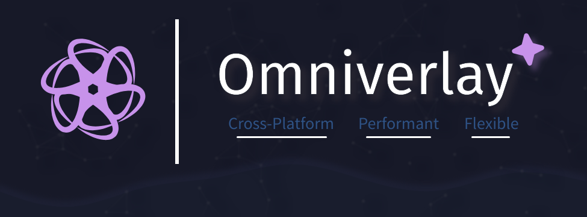

# Omniverlay ⭐



Omniverlay is a cross-platform overlay application designed to provide various informations and tools through extensions.

> **Warning:** This project is still under development. Features and functionality may change.

## Project Structure

- **`core`**: Contains the main logic for managing extensions and core functionality.
- **`extensions`**: Includes various plugins, such as CPU usage monitoring, which can be enabled or disabled.
- **`ui`**: A Tauri-based user interface for displaying overlay and interacting with the application and managing plugins.

## Features

- **Modular Design**: Easily extend the application with new extensions.
- **Cross-Platform**: Works on Windows, macOS, and Linux.
- **Plugin Management**: Enable, disable, configure, adjust plugins position via the STUDIO.

## Cross-Platform

Currently, this project has been thoroughly tested on Windows. While it is partially supported on other operating systems, we are actively working to improve compatibility across all platforms. Future updates will aim to enhance support and functionality on macOS, Linux, and others.

## Getting Started

### Prerequisites

- [Rust](https://www.rust-lang.org/) (with Cargo)
- [Node.js](https://nodejs.org/) (for Tauri)
- [Tauri](https://tauri.studio/docs/getting-started/intro) CLI

### Installation

1. **Clone the Repository**

    ```sh
    git clone https://github.com/DavidutzDev/Omniverlay.git
    cd Omniverlay
    ```

2. **Install Dependencies**

    - For core and extensions:

        ```sh
        cargo build
        ```

    - For the Tauri UI:

        ```sh
        cd ui
        pnpm install
        ```

3. **Run the Application**

    - Start the Tauri application:

        ```sh
        cd ui
        pnpm tauri dev
        ```

## Extension Development

To add a new extension, follow these steps:

1. Create a new directory under `extensions/`.
2. Follow `extensions/sample` to create a basic extension.
3. Register the extension in `ui/src-tauri/src/main.rs` by editing `bootstrap_backend` function
4. Add your UI by creating `MyExtension.svelte` in `ui/src/lib/extensions/components`

## Contributing

Contributions are welcome! Please open an issue or submit a pull request on the [GitHub repository](https://www.github.com/DavidutzDev/Omniverlay).

## License

This project is licensed under the MIT License. See the [LICENSE](LICENSE.md) file for details.
